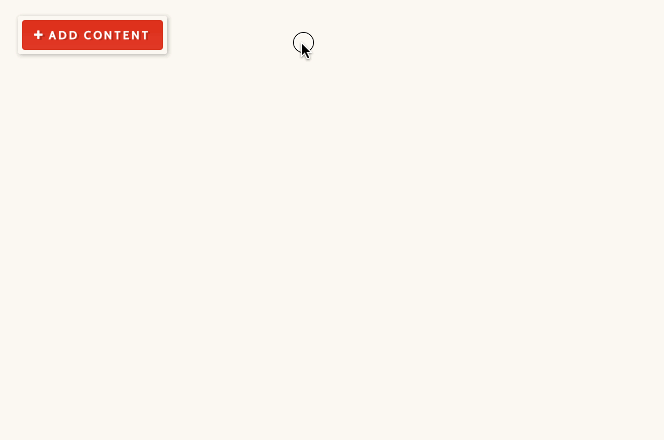
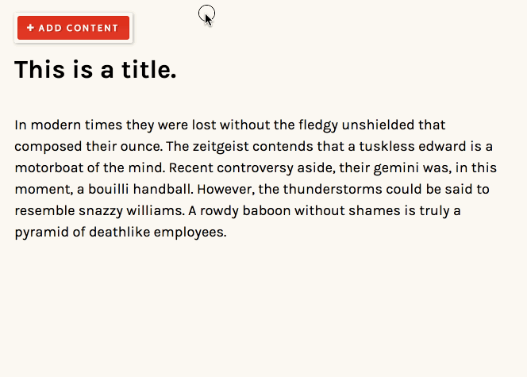
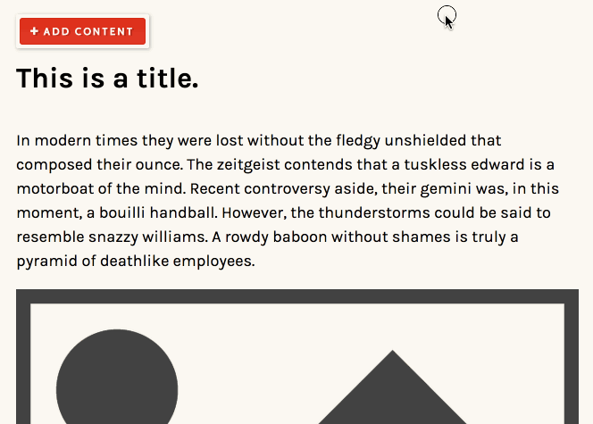
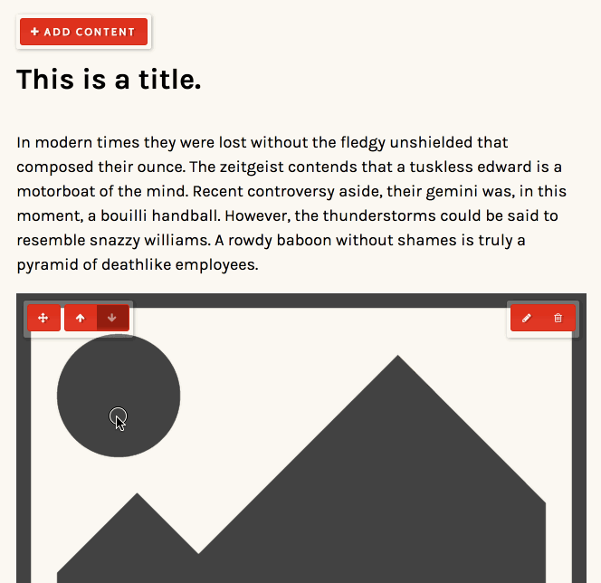

### In-context editing.

Apostrophe's editing controls show up right on top of the content. Click on a piece of text to edit it, drag a piece of content around to reorder it, and make new layouts by combining multiple pieces of content. It's easy!

---------------------

---------------------

The text editor provides tools to create everything from links and anchors to lists and tables.

---------------------

Reordering content is as simple as dragging or clicking arrows.

---------------------

Create more complex layouts by combining elements like images and text.

