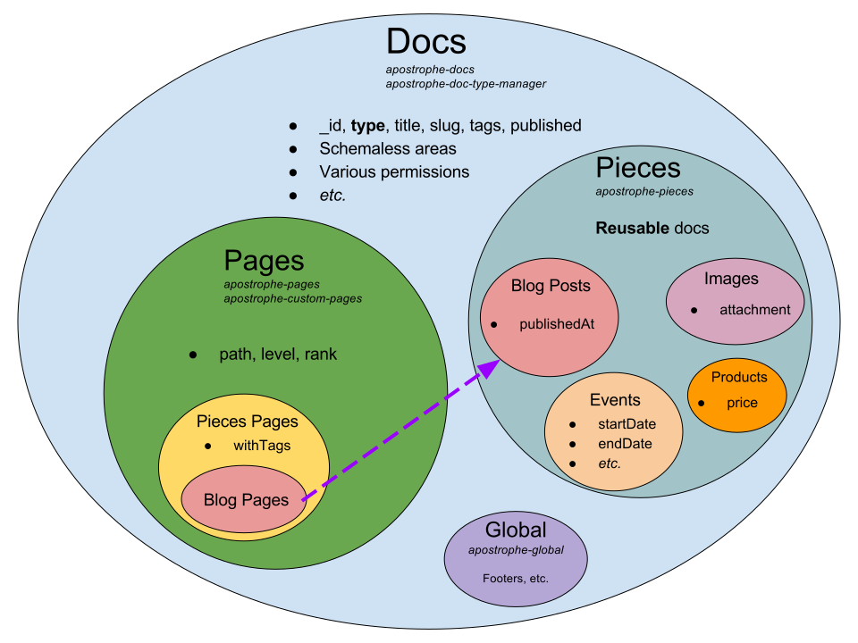

> You don't have to read this article to get started with Apostrophe. It's very handy for those who want to know more about the decisions that underpin its design and better grasp how to extend Apostrophe in new and interesting ways.

## Technology choices

Apostrophe is powered by the [Node.js](https://nodejs.org) server-side JavaScript runtime, the [MongoDB](https://www.mongodb.com) database engine, the [Nunjucks](https://mozilla.github.io/nunjucks/) template language and the [Express](https://npmjs.org/package/express) web framework.

Node.js was chosen chiefly to reduce mental gear-grinding on the part of developers who must switch constantly between JavaScript on the front and another language on the back end. Performance is a significant secondary benefit.

We chose MongoDB for its fluent JavaScript-based API, its safety from "SQL injection"—style attacks, its developer-friendliness and its support for documents with a mix of schemas in the same collection.

Nunjucks provides a syntax nearly identical to [Twig](https://twig.symfony.com/), [Jinja](http://jinja.pocoo.org/docs/2.9/) and other widely adopted templating languages. It reflects our commitment to maximize accessibility for frontend developers.

Express is the most widely used web framework for Node.js. Because it is simple, unopinionated and well-known, it was straightforward to extend it to suit Apostrophe's needs.

## Content in Apostrophe: docs, pieces, pages, widgets and areas

In Apostrophe, each document or "doc" is represented by a single document in the `aposDocs` mongodb collection. This keeps queries simple, reduces complexity and improves performance.

Each "doc" might be a *page*, such as the "home" or "about" page of a website, or a *piece*, such as a blog post, event or product. Pages can be arranged in a tree on the site, while pieces are typically managed as a collection. They gain a URL based on the location of "blog pages" or "events pages" on the site. A blog post that shares tags in common with a blog page will appear as part of that "blog," while a blog post with different tags might appear on another.

The "global doc," which is always available to templates as `data.global`, is reserved for content you'll want almost every time you render a page. It is the right place for shared footers and site-wide copyright notices, for instance.



Each doc might contain a variety of content: rich text, images, videos and even "blog widgets" that display blog posts. Each unit of content is called a *widget*. Widgets can stand by themselves, in which case they are called *singletons*. Just as often however, widgets are grouped into *areas* in which the user is free to keep adding new widgets of various types.  Frontend developers decide which widgets are allowed in each area and code their templates accordingly.


## Apostrophe's module architecture

Apostrophe represents each website as an object, the "`apos` object." Developers create an `app.js` file in which they create an `apos` object, passing configuration options to it, most of which are passed on to modules.

99% of Apostrophe's code is found in *modules*. Each module is responsible for a distinct content type or area of responsibility. A few examples include `apostrophe-db`, `apostrophe-docs`, `apostrophe-express`, `apostrophe-pieces` and `apostrophe-users`.

Apostrophe initializes each module in turn, starting with those provided in the core, followed by those added at project level as described below. For more information, see [how Apostrophe starts up](how-apostrophe-starts-up.html).

Related Apostrophe modules can be bundled together in a single [npm module](https://www.npmjs.com/), usually to distribute them as open source, but also sometimes for convenience in sharing them between your own projects. Good examples are [apostrophe-blog](https://npmjs.org/package/apostrophe-blog), which is a *bundle* containing the `apostrophe-blog`, `apostrophe-blog-widgets` and `apostrophe-blog-pieces` modules, and the `apostrophe` module itself, which contains *all the core modules necessary to create and edit a website.*

## Apostrophe's module pattern, inheritance, and moog

Apostrophe's modules are implemented following an object-oriented pattern. We chose to follow the *[self pattern](http://justjs.com/posts/this-considered-harmful)*, in which all methods are directly attached to their objects, inside a *[closure](https://developer.mozilla.org/en-US/docs/Web/JavaScript/Closures)* created by the `construct` function of the module.

We chose this pattern over the ES6 `class` keyword primarily because of its [numerous benefits when working with asynchronous code](http://justjs.com/posts/this-considered-harmful). In addition, our [moog](https://npmjs.org/package/moog) and [moog-require](https://npmjs.org/package/moog-require) modules provide a richer form of inheritance in which Apostrophe can automatically "fill in" subclasses that intuitively should exist, without the need for the programmer to write "boilerplate" code to fill gaps in the inheritance tree. For instance, if your project has a `products` module that extends `apostrophe-pieces`, Apostrophe will guarantee that an `apostrophe-pieces-editor` "moog type" also exists in the browser, even if you don't bother to explicitly provide one because you don't need to override any of its methods.

This greatly simplifies extending "virtual base classes" like the `apostrophe-pieces` module to create your own content types.

### Related types

Apostrophe also provides "autoloading" of *related types*. For instance, modules that extend `apostrophe-pieces` automatically also provide subclasses of `apostrophe-pieces-cursor`, and the `find()` method of the module acts as a *factory method* that returns such a cursor. And if a customized definition for that cursor type is available in `lib/cursor.js`, it is automatically loaded.

### The self pattern, performance and functional programming

The self pattern does impose a small speed penalty when objects are constructed. To mitigate this, Apostrophe typically uses "plain old objects" to represent individual documents on the website, and creates a smaller number of "manager" and "cursor" objects with methods and full-scale inheritance to work with those documents. Fortunately, this architectural choice also facilitates *functional programming*, in which such separation of code and data is strongly encouraged.

### More information about modules

For more information, see [how Apostrophe modules are structured](how-apostrophe-modules-are-structured.html).

## Project level: overriding and extending Apostrophe in your project

The concept of "project level" folders is a crucial one in Apostrophe. Let's look at how developers routinely extend Apostrophe's modules to create a unique site.

#### Implicit subclassing: adding server-side code to core modules

When Apostrophe loads the `apostrophe-login` module, it looks here first:

`node_modules/apostrophe/lib/modules/apostrophe-login/index.js`

Then Apostrophe *also looks here*, at "project level:"

`lib/modules/apostrophe-login/index.js`

A `construct` function provided here is invoked after the `construct` function of the original module.

This gives your code a chance to *implicitly subclass* the original `apostrophe-login` module, adding features that only matter for a single project.

### Template overrides at project level

When a module renders a Nunjucks template, for instance by calling `self.render`, Apostrophe will look in the `lib/modules/views` folder of that module.

If the module is a subclass of another module, Apostrophe will look in the subclass module's `views` folder first, before checking the parent. And this includes project-level "implicit subclasses."

In other words, when Apostrophe seeks to render `login.html`, it looks here first, at "project level:"

`lib/modules/apostrophe-login/views/login.html`

*Only if that file does not exist* does Apostrophe look at the original:

`node_modules/apostrophe/lib/modules/apostrophe-login/views/login.html`

### CSS and JS assets: extending at the project level

Apostrophe modules push assets to the browser via the `pushAsset` method.

If a base class, like `apostrophe-pieces`, pushes an asset such as `user.js`, and another module extends `apostrophe-pieces` and provides its own `user.js`, Apostrophe will push **both of them**, beginning with the parent class.

This holds true for implicit subclasses, such as a `lib/modules/apostrophe-pieces` folder at project level.

So Apostrophe will send them to the browser in this order, if they exist:

```
# Original npm module
node_modules/apostrophe/lib/modules/apostrophe-pieces/public/js/user.js
# Project-level implicit subclass of all pieces
lib/modules/apostrophe-pieces/public/js/user.js
# apostrophe-blog module, a subclass of pieces
node_modules/apostrophe-blog/public/js/user.js
# Project-level implicit subclass of blog
lib/modules/apostrophe-blog/public/js/user.js
```

You **do not** have to push the file again in each subclass.

The same rule applies to `.less` or `.css` assets.

This allows us to easily write browser-side code that extends the styles and/or JavaScript already given to us by the original version of the module.

## How Apostrophe handles web requests

Apostrophe responds to web requests via a combination of [Express middleware](http://expressjs.com/en/guide/using-middleware.html), custom Express routes and a "wildcard" route that maps incoming requests to pages in the CMS. For more information, see [how Apostrophe handles requests](how-apostrophe-handles-requests.html).

### Separating async logic from templates

Because Apostrophe is built on Node.js, it is asynchronous. However, we have chosen to keep Nunjucks template code synchronous. This means that all data needed to render a page must be loaded and made available as properties of `req.data` before the template is rendered. This data then becomes available to the template as the `data` object.

This was done to avoid introducing complex back-end async programming concepts into frontend template code. Code dealing with callbacks belongs in JavaScript, not Nunjucks. Synchronous templates also render faster.

The `pageBeforeSend` method of each module is your last chance to carry out async tasks before the page is rendered. For more on this technique, see [how Apostrophe handles requests](how-apostrophe-handles-requests.html).

## Apostrophe schemas

A schema defines the fields that make up a content type, such as an Apostrophe piece or page type. While MongoDB does not force your documents to have a schema, Apostrophe adds robust schemas while still allowing for documents of many different types to coexist in the `aposDocs` collection. Pages can even be switched between types, changing the fields that the user might be asked to supply in the "Page Settings" dialog box on the fly.

Apostrophe's schemas are extensible; there's a documented way to add entirely new field types.

Any module extending `apostrophe-pieces` or `apostrophe-custom-pages` can easily add new schema fields to the piece or page, so that the user is invited to edit them when creating a new document.

Schemas are also used to define the editable fields of a widget That allows new widgets to be created very quickly without the need for custom code.

For more information, see the [schema guide](../tutorials/getting-started/schema-guide.html).

## Apostrophe joins

Apostrophe also supports robust "joins" between content types. Programmers can define their own relationships between doc types, such as pages or pieces, and even between widgets and pages, or widgets and pieces. Joins are discussed in the [schema guide](../tutorials/getting-started/schema-guide.html).

## Dynamic properties and the magic `_`

There's one catch with Apostrophe's policy of "simple objects:" it's not immediately clear which properties of an object were dynamically added to it on the fly, such as a joined object or the `._url` property, and which should be stored back to the database when that object is saved. This is important because storing "joined" objects back to the database would take up a tremendous amount of extra space.

Apostrophe solves this with one simple rule: *any property starting with an `_` is left out of the database, except for `_id`.* And this rule holds true no matter how deeply nested the property is. 

The moral of the story: *always use a leading _ when naming a join field*, and *never use a leading _ when naming another type of field* such as a `string` field.

## Apostrophe glossary

To speed your understanding, we also recommend reading through the [Apostrophe glossary](../glossary.html).

## Did this help?

We know Apostrophe introduces many new concepts. Did this document help you understand it better? Feedback is welcome. Feel free to raise issues on the [Apostrophe documentation project in github](https://github.com/punkave/apostrophe-documentation).