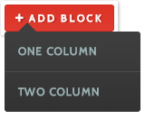

## Using areas in complex layouts
Areas and singletons are great for creating and editing content, but they don’t offer much control over layout on their own.  For creating more complex layouts to contain areas and singletons, we have blocks.  Blocks allow us to define layout templates which we can create and modify on the fly, just like areas.

### Adding Blocks to your project
To get started with blocks, first add the apostrophe-blocks module to your project.
npm install apostrophe-blocks
Next, let’s add our configuration to `app.js`.  Within the `modules` object, lets add
```javascript
'apostrophe-blocks': {
      types: [
        {
          name: 'one',
          label: 'One Column'
        },
        {
          name: 'two',
          label: 'Two Column'
        }
      ]
    }
```
### File Structure
In this configuration, we are specifying two block types, “One Column” and “Two Column”.  Each block type has its own html file referenced by the name field.  These html files will live in 
lib/modules/apostrophe-blocks/views.  So in our lib/modules folder, lets add a folder for apostrophe-blocks, and within that, a folder for views. 
```bash
mkdir -p lib/modules/apostrophe-blocks/views
```
Now we can create the actual templates, one.html and two.html. 
```bash
touch lib/modules/apostrophe-blocks/views/one.html
touch lib/modules/apostrophe-blocks/views/two.html
```
And lastly, lets make a file to put the css for our blocks, `/public/css/blocks.less`. And add that file to our `site.less` imports.  
```bash
touch public/css/blocks.less
echo “@import 'blocks.less';” >> public/css/site.less
```

Your project’s file structure should now look like:
```
/
    app.js
        /lib
            /modules
                  /apostrophe-blocks
                       /views
                           one.html
                           two.html
        /public
            /css
                blocks.less
                site.less
```


### Making Block Templates
In our templates, one.html and two.html, lets add some markup.

#### `one.html`  
```twig
<div class=”column-full”>
   {{ aposArea(page, prefix + 'left') }}
</div>
```

#### `two.html`  
```twig            
<div class=”column-left”>
   {{ aposArea(page, prefix + 'left') }}
</div>
<div class=”column-right”>
   {{ aposArea(page, prefix + ‘right’) }}
</div>
```

Note the usage of the prefix keyword before the area name.  This is a unique id for each block instance and it is required that you use it when defining areas and singletons within block templates.  Let’s finish things up by putting some basic styles in blocks.less.


### `blocks.less` 
```less
.column-full {
    width: 100%;
}
.column-left {
    width: 48%;
    margin: 0 1% 0 1%;
}
.column-right {
    width: 48%;
    margin: 0 1% 0 1%;
    float: right;
}
```

### Using Blocks on a Page
Now that we have two block types configured in the project, let’s look at adding them to a page template.  It is as simple as adding this line to any page template in your project.
```twig
{{ aposBlocks(page, 'main', [ 'one', 'two' ]) }}
```
Like areas, we supply a name for the block group with the second argument.  We also need to specify which block types we want to permit in this block group.  At this point, we’re ready to start making blocks on the page.  

On the page where you added the blocks, we’ll now find the control to “Add Blocks” much similar to the way we’ve been adding areas.

<br>
*Creating new Blocks is as simple as creating new areas.*

You’ll notice our one and two column layouts are here, and clicking either will generate a block with the markup from the respective template.  Each block gets its own controls.  You have the ability to move and rearrange blocks around each other, switch the template layout of the block, and delete it.  Switching the layout works well if you are switching between layouts that use the same name for a similar area.  In our case, since we used “left” as the name for the area within the one-column layout, when we switch it to the two-column layout, our content will adapt to the new layout and become the left column.

<br>
*Each Block’s controls allow you to move it around, change the layout, and delete it from the page.*


