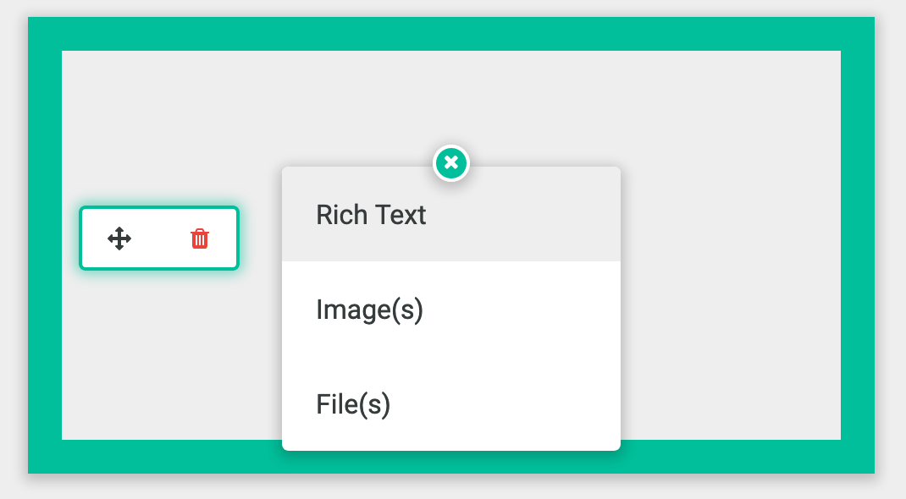

# Adding Editable Content to Pages

There are several tools that you have available to empower users to create content in context on pages. To see this is in action, next you'll add a rich text editor, an image widget, and a file uploader to the page.

## `apostrophe-rich-text`

The `apostrophe-rich-text` widget is based on [CKEditor 4](http://ckeditor.com/). There are [many options available](link-to-more-options) to configure it. You can add it to the page by editing default.html.

1. Open `default.html`.

2. Below the hero section, create a `main-content` block with a rich text editor:



```markup
<div class="main-content">
  {{ apos.singleton(data.page, 'textBlock', 'apostrophe-rich-text', {
    toolbar: [ 'Styles', 'Bold', 'Italic' ],
    styles: [
      { name: 'Title', element: 'h3' },
      { name: 'Meta', element: 'h5' }
    ]
  }) }}
</div>

```



Now you can add and edit text inline on the page.

## `apostrophe-images`

The `apostrophe-images` widget lets you add one or more images. If multiple images are added in a single widget, they are presented as a slideshow.

Below the rich text widget, add images:



```markup
  {{ apos.singleton(data.page, 'heroPic', 'apostrophe-images', {
    minSize: [ 700, 350 ],
    aspectRatio: [ 2, 1 ],
    limit: 1,
    size: 'full'
  }) }}
```



## `apostrophe-files`

The `apostrophe-files` widget lets you add download links to access various documents, such as PDFs or Word files. If multiple files are added in a single widget, they are presented as a list.

Add this below the images widget to add a simple `apostrophe-files` widget to the page:




```markup
  {{ apos.singleton(data.page, 'resume', 'apostrophe-files', {
    limit: 1
  }) }}
```



## Make it work together

Lastly, let's add an area where you can select from the three different options to add them to a page.

Add this `apos.area` at the top of your main block:



```markup
{{ apos.area(data.page, 'body', {
    widgets: {
      'apostrophe-rich-text': {},
      'apostrophe-images': {},
      'apostrophe-files': {}
    }
  }
) }}
```



Now you can add text, images, and files to a page seamlessly.



## Getting Started

_Singletons? `apos.area`? What is all this stuff?_ Right now you're just scratching the surface of Apostrophe's capabilities. You've got some of the basics nailed down, but there's so much more to Apostrophe. When you're ready, move on to [Core Concepts](relative-link) to learn more about the tools you need to unleash the full power of Apostrophe.

