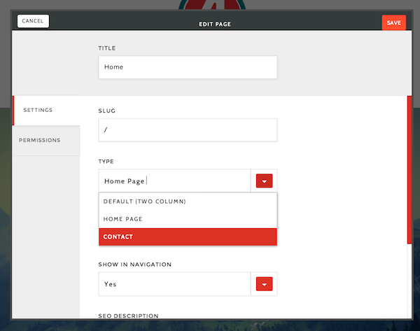

## What am I looking at?
Now that you’ve got your project created, you might be wondering how these files and folders work together to make a website. More likely, you’re probably wondering how to start making changes to the sandbox site as quickly as possible. This tutorial is designed to get you familiar with Apostrophe’s static assets structure, understanding the basics of Apostrophe’s template page structure, creating new page types, and adding custom assets to Apostrophe's pipeline.


### The File Structure
The initial file structure of Apostrophe’s sandbox contains several convenience scripts and configuration files for things like deployment, updating, and localization; but, right now we’re concerned about 3 things:

##### app.js
Apostrophe’s main configuration file. You’ll be spending a good deal of time here customizing your project.

##### |--- public/
Apostrophe’s static asset folder. This contains all your LESS/CSS/JS/image assets that get served to the browser. This is where you’ll be customizing the look and front-end functionality of your website.

By default, Apostrophe does any necessary compiling and minification to `/public/css/site.less` and `/public/js/site.js` when the server starts. Sometimes working within these two files is enough for your site. More on [modifying what is served on start later](editing-existing-page-templates.html).

##### |-- views/
Apostrophe’s template folder. This is where much of the markup structure of Apostrophe’s core front-end lives. Inside `views` are two sub folders: `global` and `pages`. This is where structural page markup and page templates live, respectively.


## Understanding Page Templates
The sandbox’s structural markup is broken up into three main files in the `views/global` directory: `base.html`, `outerLayout.html`, and `layout.html`. It is worth noting that these three files could be combined into one file with no repercussion, however they are broken up semantically with the following intents:

##### base.html  
A basic HTML document, it includes the bare bones of any good webpage, including a `<head>` block with hooks for meta information about your site, hooks for stylesheets and front-end javascript to be included via Apostrophe, and an initial `<body>` class for determining whether a user is logged in or not. base.html is extended by `outerLayout.html`
##### outerLayout.html 
OuterLayout contains much of Apostrophe’s admin interface markup, including the floating menu bar you see at the top left of the screen when you log in and the context menu that sits on the bottom left. Most of outerLayout doesn’t need to be edited but when customizing the admin UI of your project, you might extend options of the menu bar. At the bottom of outerLayout, you’ll see Apostrophe set up a container called ‘`apos-refreshable`’

`apos-refreshable` allows Apostrophe to update your page as edits are made without refreshing your browser.

##### layout.html
layout extends `outerLayout` and lets you get to the guts of your site. In the sandbox this is used as a base for the general layout of your website including global elements like header, navigation, footer, etc. 

### Page Types
Alright, we’re looking at the guts of our site. So how do we customize things on a per-page basis?

Page Types allow you to create reusable templates for the various pages on your site. This allows you the flexibility to style content in a number of different ways depending on the needs of your page.

#### Adding a Page Type
Let’s say we have a layout that we want our Contact page to have that’s custom to the rest of the site. We need to add this template to our Page Types.

Page Types begin as a configuration in `app.js`, and the sandbox comes pre-loaded with a few examples to get your started. Let’s add our Contact page to the ‘types’ array in the ‘page’ object of apostrophe-site. Your code should look like this:

```javascript
var site = require('apostrophe-site')({
	…
	pages: {
    types: [
      { name: 'default', label: 'Default (Two Column)' },
      { name: 'home', label: 'Home Page' },
      { name: 'contact', label: 'Contact' }
    			]
  		},
...
});
```

Alright, Apostrophe is now looking for a template called ‘contact’. But where is it looking?
When adding page types Apostrophe looks for templates in the `/views/pages` folder. It uses the ‘name’ property of our new type, resulting in Apostrophe looking for a template called `/views/pages/contact.html`.

So we’ve added a page type and created a template, now all we have to do is select it from the Page Settings of the Contact page. 



### Dealing with Custom Assets
Great, we’ve got our site and our custom contact page. Now we want to add a 3rd party carousel plugin to our homepage. We could jam the code and styles into our site.`less/site.js` files but that wouldn’t be ideal.

We want Apostrophe to go looking for those assets and add them to the minification/compiling pipeline each time the server starts.

#### Adding Static Assets
Our plugin comes in a tidy bundle: a `carousel.js` and a `carousel.css`. For the sake of argument, let’s say that this is a JavaScript plugin and even though it contains CSS, it should ride along with the other JS assets.

1. In `/public/js` create a folder called vendor
2. In `/public/js/` vendor create a folder called carousel
3. In `/public/js/vendor/carousel` drop our carousel.js and carousel.css


#### Loading Static Assets
In `app.js`’s configuration of apostrophe-site the `assets` object defines what assets get included with Apostrophe when the server starts. Let’s add our plugin to the scripts array in apostrophe-site’s assets object:

```javascript
...
assets: {
    scripts: [ 'vendor/carousel', 'site-compiled'],    
    stylesheets: ['site']
  },
...
```


## What’s Next?
Now that you’ve learned Apostrophe’s basic file structure, you should try adding your own custom page. In the next tutorial, we will go over adding editable content to your new page.
