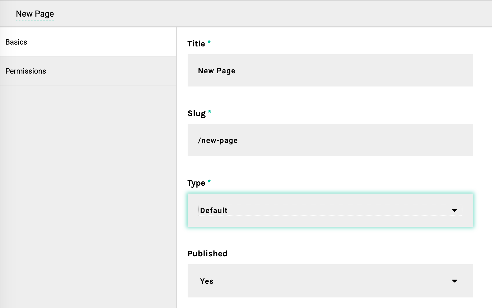

# Adding a New Page Template

The pages that you create in Apostrophe's user interface are based off of templates. If you want to create a new type of page, you need to create a new template and register it in  `app.js`.

## Adding a New Page Template

Let's add a `default` template for new pages.

1. Open `app.js` from the root of your project.

2. Add the configuration for `default` in the `apostrophe-pages`.



```javascript
    // This configures our default page template
    'apostrophe-pages': {
      types: [
        //This is the new section
        {
          name: 'default',
          label: 'Default'
        },
        //The rest is what what was there already
        {
          name: 'home',
          label: 'Home'
        },
      ]
    },
```



This adds the template into the configuration, but since you never created a template, it won't actually add a page. Next, you'll create a template to use for creating new pages.


If you are not using `nodemon`, you will need to restart the node app when you make most code changes. In the terminal window, press control-C, then type: `node app.js`

This is because every node application is a webserver in its own right. Unlike PHP applications, node apps "stay alive" indefinitely, handling many page requests asynchronously for better performance. Later, [in production](../intermediate/deployment.md), we'll use a more robust webserver as a "frontend proxy" to help handle the load.


## Creating Pages from Templates

Based on what you added to `app.js`, Apostrophe is looking for `lib/modules/apostrophe-pages/views/pages/default.html`. So let's create it now.

1. In the `lib/modules/apostrophe-pages/views/page/default.html` folder, create a file named `default.html`.

2. Make sure that you're logged in, and from your Apostrophe homepage, click *Pages*, and then *New Page*.

3. From here, select the new *Default* template, set your page's name and click *Save*.



Now let's add content to the page.

With an empty `default.html`, we don't get much; not even a page title. But we can get quite a bit for free just by extending a layout template.

[Nunjucks](https://mozilla.github.io/nunjucks/) allows you to extend another template, with the option of overriding `blocks` to update or change the template. Add this to the top of `default.html`:



```markup

```



### Using blocks to override parts of the layout

Now that we've extended `layout.html` in `default.html`, we can override the `beforeMain` block. Let's add a hero section to the top of the page:



```markup

  <div class="block hero">
    <div class="inner">
      <div class="hero-text">
        <h4>Welcome to my first Apostrophe site!</h4>
      </div>
    </div>
  </div>

```



Because we extended the layout, we can avoid duplicating a lot of markup.

### Including, importing and extending files from many modules

Sometimes you'll want to write Nunjucks macros, include files, or extensible layouts that are used by many different Apostrophe modules. For convenience, you can put these "global" templates in the top-level `views/` folder of your project. Any template not found in the current module will be located there as a "fallback." _In older projects, this won't work unless you enable it. See_ `app.js` _in the_ [_apostrophe-boilerplate_](https://github.com/punkave/apostrophe-boilerplate) _project._

**But what about editable content?** Good question! That's the next topic.

